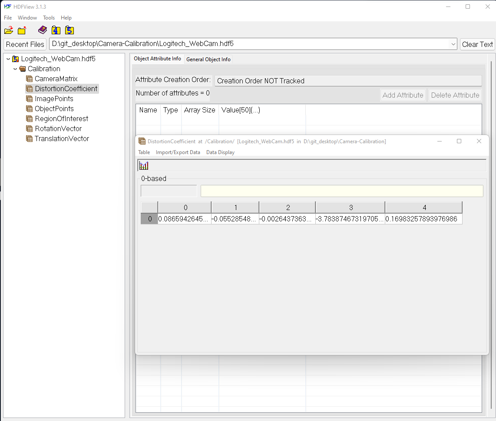
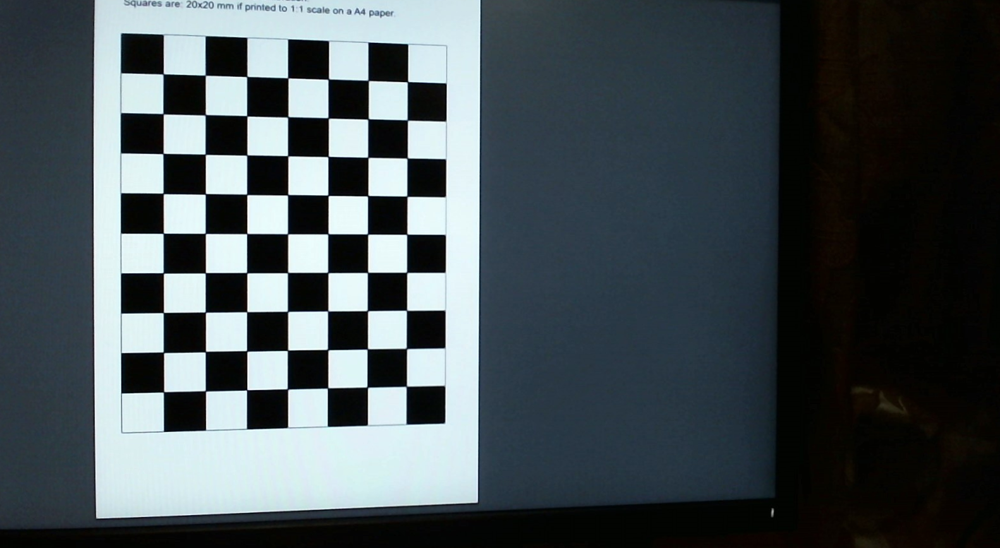

# Camera-Calibration


The above image shows the calibration in action . I have used a [7*9 chessboard](https://www.mrpt.org/downloads/camera-calibration-checker-board_9x7.pdf) image for calibration .


## To Run the program

1. Create a virtual environment

   Windows 

   ```powershell
   python -m venv .\venv
   venv\Scripts\activate.bat
   ```

    macOS & Linux

   ```shell
   python -m venv ./venv
   source venv/bin/activate
   ```

2.  Install the project dependencies with the following command.

   ```shell
   pip install -r requirements.txt
   ```

   

3. Run the project 

   ```powershell
    python .\main.py
   ```

   

## Storing file for calibration:

The calibration images can be stored at **calibration_images**

For testing the distortion we can put the files in test_images and type the file name in main.py .The output of the corrected images are stored as <u>filename_undistorted.png</u>  and <u>filename_undistorted_method_2.png</u> .

To check the difference between them we can use the <u>difference</u> function in removeDistortion.py which saves the files as <u>filenamesubtract.png</u>

Camera configurations are stored as HDF5 file , we can view the contents of the file using [HDFView](https://www.hdfgroup.org/downloads/hdfview/).

Here is a screenshot of the HDF5 file.



### 

### Example of  undistorted image using this program:



### References 

[OpenCV reference page](https://docs.opencv.org/4.5.2/dc/dbb/tutorial_py_calibration.html)
